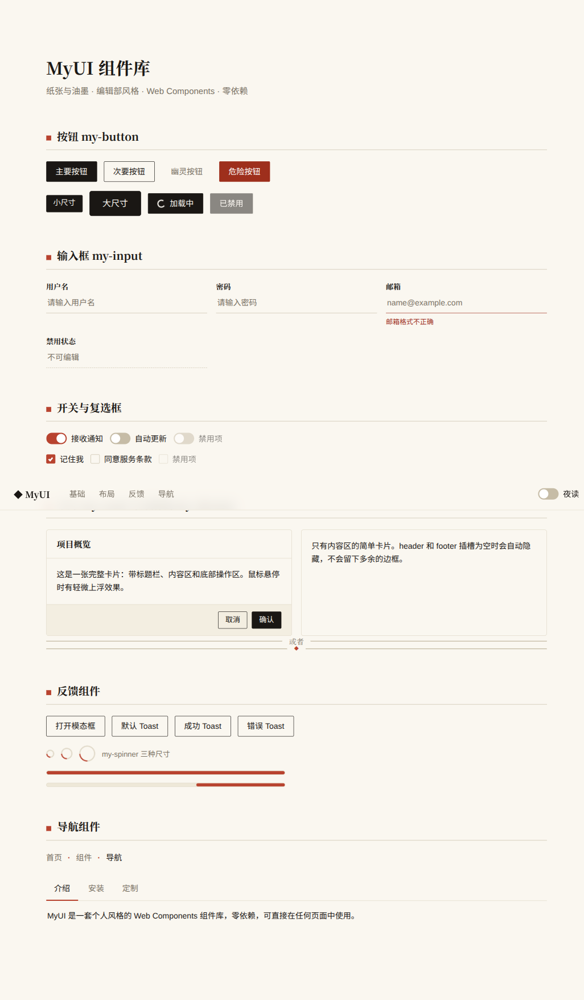
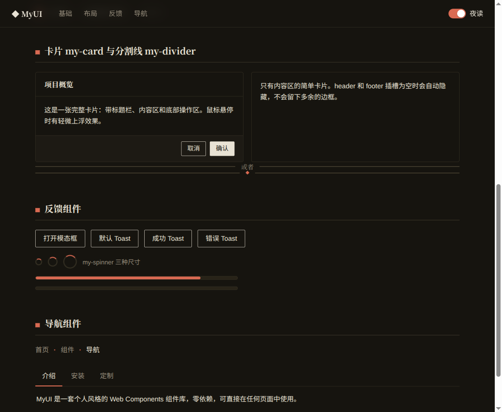
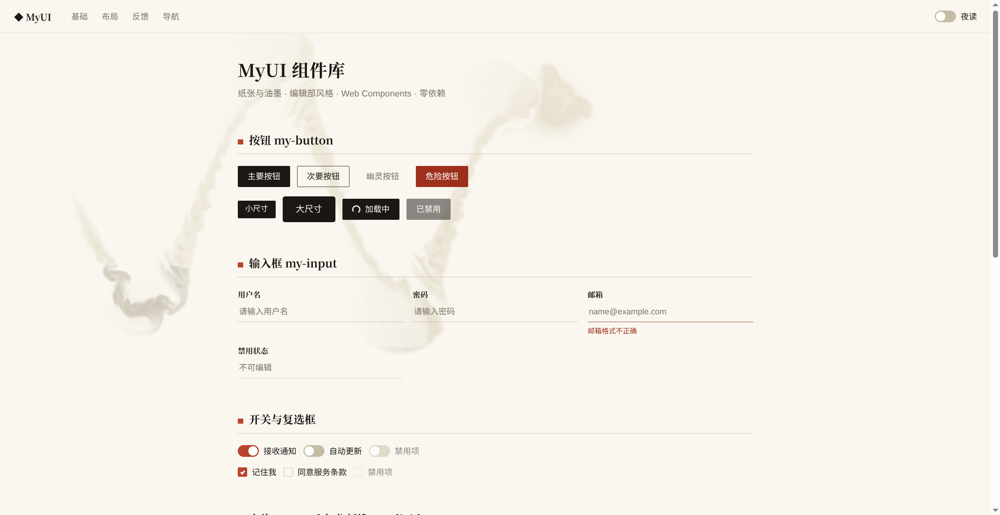

# 纸墨 ZhiMo UI

「纸张与油墨」编辑部风格的 Web Components 组件库：米白纸底、墨黑文字、衬线标题，朱砂印章红作为全局唯一强调色，层次靠细墨线而非阴影。零依赖、跨框架，可直接用于任何 HTML 页面，也能在 React / Vue 项目中当普通标签使用。组件标签前缀为 `zhimo-`（如 `<zhimo-button>`）。

**🖌 在线演示：<https://conflux-union.github.io/zhimo-ui/>**（在页面上滑动鼠标试试墨染效果，点击会滴一滴墨）

## 预览

| 亮色 | 夜读模式 |
| --- | --- |
|  |  |

墨染背景（GPU 流体模拟，鼠标滑过纸面晕开墨迹）：



风格签名：

- 输入框是「稿纸底线」式，聚焦时底线变朱砂色
- 导航链接和幽灵按钮 hover 时朱砂下划线从左游走出来
- 开关、复选框、进度条、tab 下划线、面包屑分隔点——朱砂红只在这些交互点出现
- 模态框顶部有一道朱砂色刊头线，分割线默认带居中的红色 ◆
- 暗色是「夜读模式」：深茶色纸底，不是冷冰冰的纯黑

## 快速开始

组件使用 ES Module，需要通过 HTTP 服务访问（直接双击 html 文件会因浏览器限制无法加载模块）：

```bash
cd zhimo-ui
python3 -m http.server 8000
# 浏览器打开 http://localhost:8000
```

在自己的页面中使用：

```html
<link rel="stylesheet" href="src/tokens.css">
<script type="module" src="src/index.js"></script>

<zhimo-button variant="secondary">点我</zhimo-button>
```

## 组件一览

| 组件 | 标签 | 主要属性 / API |
| --- | --- | --- |
| 按钮 | `<zhimo-button>` | `variant`: secondary / ghost / danger；`size`: sm / lg；`disabled`、`loading`、`block` |
| 输入框 | `<zhimo-input>` | `label`、`placeholder`、`type`（含 `textarea` 多行模式 + `rows`）、`error`、`disabled`；`.value` 读写 |
| 滑块 | `<zhimo-slider>` | `min` / `max` / `step` / `value`、`disabled`；`change` 事件（`e.detail.value`）；`.value` 读写 |
| 开关 | `<zhimo-switch>` | `checked`、`disabled`；`change` 事件（`e.detail.checked`） |
| 复选框 | `<zhimo-checkbox>` | 同开关 |
| 卡片 | `<zhimo-card>` | `hoverable`；插槽：`header` / 默认 / `footer`（空插槽自动隐藏） |
| 分割线 | `<zhimo-divider>` | 可在标签内写文字，显示为居中分隔文案 |
| 模态框 | `<zhimo-modal>` | `heading`；`.show()` / `.close()`；`close` 事件；Esc / 遮罩可关闭 |
| Toast | `toast(msg, opts)` | `import { toast } from './src/index.js'`；`type`: success / error / warning；`duration` 毫秒 |
| 加载 | `<zhimo-spinner>` | `size`: sm / lg |
| 进度条 | `<zhimo-progress>` | `value`(0–100)、`indeterminate` |
| 导航栏 | `<zhimo-navbar>` | 插槽：`brand` / 默认（链接）/ `actions`；吸顶 + 毛玻璃 |
| 标签页 | `<zhimo-tabs>` + `<zhimo-tab label="...">` | `change` 事件（`e.detail.index / label`）；`.select(i)` |
| 面包屑 | `<zhimo-breadcrumb>` | 直接放 `<a>` / `<span>`，自动加分隔符，末项高亮 |
| 下拉菜单 | `<zhimo-dropdown>` + `<zhimo-menu-item value="...">` | 插槽 `trigger` 点击展开；`.openAt(x, y)` 可作右键菜单；`select` 事件（`e.detail.value`）；菜单项支持 `danger` / `disabled` |
| 选择器 | `<zhimo-select>` + `<zhimo-option value="...">` | `label`、`placeholder`、`value`、`disabled`；`change` 事件（`e.detail.value`）；上下方向键换选项 |
| 墨染背景 | `<zhimo-ink-paper>` | `image`：背景图地址。内置 Stable Fluids 流体模拟：鼠标滑动把墨和动量注入流场，墨被水流推着卷出涡旋须，蚀开纸面露出背景图；点击是一滴墨砸进水里炸开成环；随时间稀释、纸面复原。放在 `<body>` 内任意位置（固定全屏、不挡交互）；尊重系统的"减少动态效果"设置。手感参数都在 `src/ink.js` 顶部的常量里 |

## 定制你的风格

所有视觉决策都集中在 `src/tokens.css`，改这一个文件即可全局换肤：

- **墨色**：`--zhimo-accent` / `--zhimo-accent-hover` / `--zhimo-accent-fg`（实心按钮等主操作的颜色）
- **印章色**：`--zhimo-seal` / `--zhimo-seal-hover`（全局唯一强调色，换掉它整套库的"点睛色"就变了）
- **纸色**：`--zhimo-bg` / `--zhimo-bg-subtle` / `--zhimo-bg-hover`
- **字体**：`--zhimo-font`（正文无衬线）/ `--zhimo-font-serif`（标题衬线）
- **圆角**：`--zhimo-radius` / `--zhimo-radius-sm`（默认 4px / 2px 的印刷品棱角）
- **动效速度**：`--zhimo-transition`

夜读模式：给 `<html>` 加 `data-theme="dark"` 即可，演示页右上角的开关就是这样实现的。

## 目录结构

```
zhimo-ui/
├── index.html        # 演示页（所有组件的活样例）
├── README.md
├── assets/           # 演示背景图与预览截图
└── src/
    ├── tokens.css    # 设计令牌（全局变量）
    ├── index.js      # 统一入口，引入即注册全部组件
    ├── base.js       # 按钮、输入框、开关、复选框、滑块
    ├── layout.js     # 卡片、分割线
    ├── feedback.js   # 模态框、Toast、加载、进度条
    ├── nav.js        # 导航栏、标签页、面包屑
    ├── menu.js       # 下拉菜单、选择器
    └── ink.js        # 墨染背景（GPU 流体模拟，含 CPU 回退）
```

## 新增组件的套路

1. 在对应分类文件里写一个 `class ZhimoXxx extends HTMLElement`，在构造函数里 `attachShadow` 并写入样式 + 结构；
2. 样式只使用 `tokens.css` 里的 `--zhimo-*` 变量，保证风格统一、自动支持暗色模式；
3. 文件末尾 `customElements.define('zhimo-xxx', ZhimoXxx)`；
4. 在 `index.html` 加一个演示区块。
